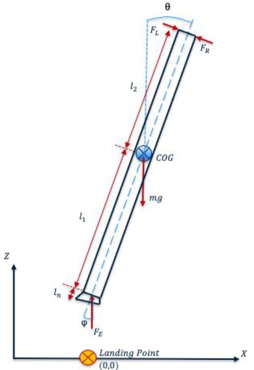
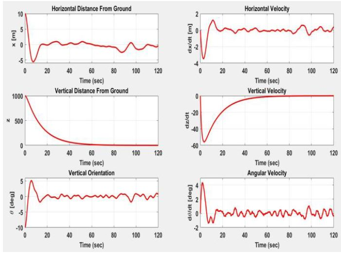
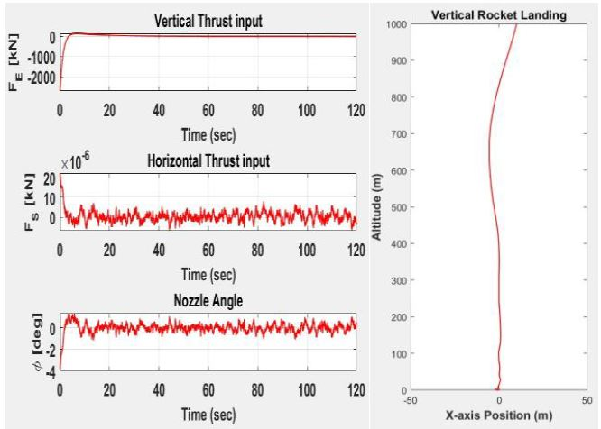

# Controlling the Vertical Landing of a Rocket

Figure 1: Free body diagram of First Stage Rocket

Figure 2: LQG State Plots

Figure 3: LQG Input Plots (L), Landing Trajectory (R)

## Description
* Modeled the landing of a rocket using modern controls engineering techniques and state space modelling.
* Designed a LQR controller to control the downward velocity and tilt of the rocket as it lands.
* Added a kalman filter to take into effect disturbance noise, such as wind, and measurement noise of the sensors and designed an overall LQG controller

## Usage
* Open and run the rocket_main_LQR.m file to see the LQR plots
* Open and run the rocket_main_LQG.m file to see the LQG plots

## Author
* Jonas Chianu